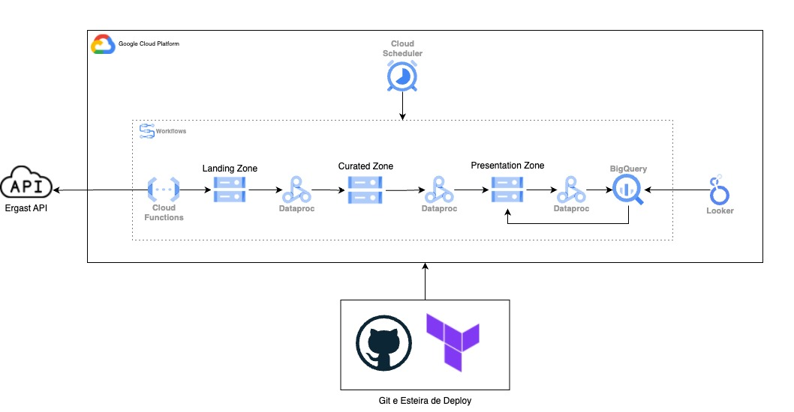
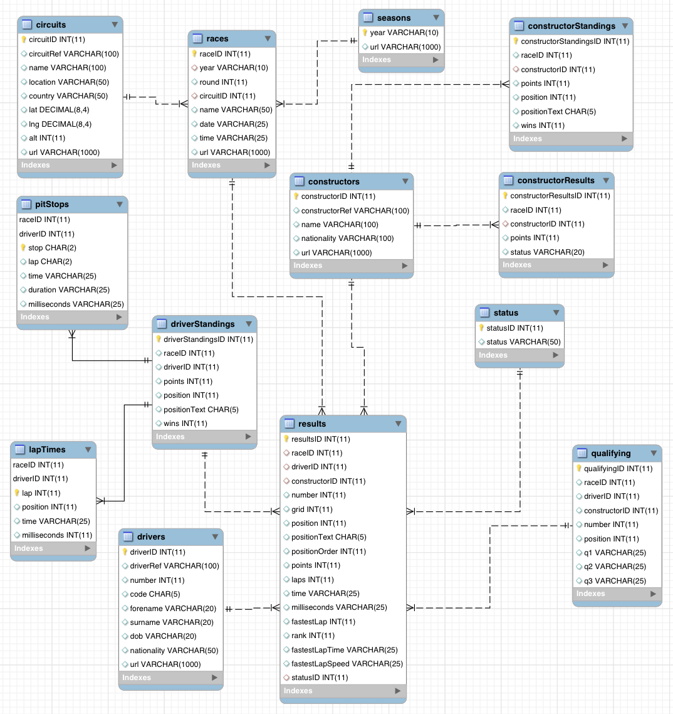
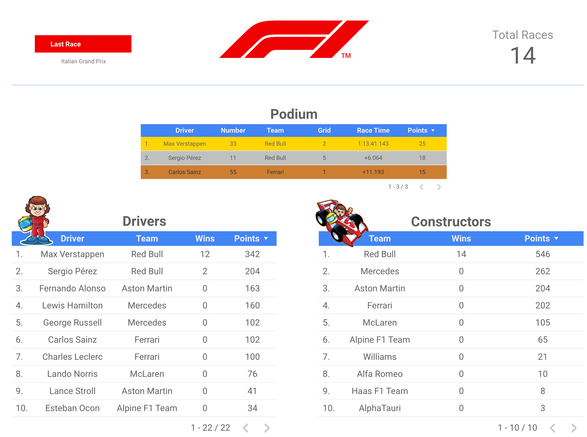

# F1-Racing-DE

### 1. Arquitetura 

### 2. Projeto
O projeto foi inspirado no [curso](https://www.udemy.com/course/azure-databricks-spark-core-for-data-engineers) ministrado pelo professor Ramesh Retnasamy, porém, diferentemente do projeto original, o meu utiliza as tecnologias da Google Cloud em vez do Databricks. Além disso, é utilizado o Terraform para automatizar o deploy e a utilização de ferramentas serverless.

##### 2.1 Descrição do dataset
Utilizamos a [API do Ergast](https://ergast.com/mrd/).

"A API de Desenvolvedor Ergast é um serviço web experimental que fornece um registro histórico de dados de corridas de automobilismo para fins não comerciais. Por favor, leia os termos e condições de uso. A API fornece dados para a série de Fórmula 1, desde o início dos campeonatos mundiais em 1950."

### 3. Solução

##### 3.0 Terraform

Toda a infraestrutura está mapeada em código, facilitando o deploy de todas as ferramentas através de um único comando. Utilizaremos o GitHub Actions para automatizar o deploy sempre que um novo pull request (PR) for aceito na branch main.

##### 3.1 Cloud Scheduler
A função do Cloud Scheduler é agendar a execução do Workflows todas as segundas-feiras às 10h da manhã.

##### 3.2 Workflows

O Workflows é responsável por executar todo o nosso pipeline de dados, iniciando ao chamar a Cloud Function encarregada de coletar os novos dados por meio da API da Ergast. Em seguida, entra em ação um script Pyspark que é executado pelo Dataproc para realizar o tratamento dos dados.

##### 3.3 Cloud Functions

A Cloud Function coletará o CSV através da API do Ergast e armazenará os dados descompactados no data lake. 

##### 3.4 Dataproc

O Dataproc executará os scripts Pyspark, encarregados de filtrar, limpar, agregar e salvar os dados, dividindo-os em camadas, tanto no BigQuery quanto no data lake.

##### 3.4 Data lake

Local que armazenará os dados dividos por zonas: "landing zone", "curated zone" e "presentation zone".

##### 3.5 Big Query

O Big Query é o nosso data warehouse, que conterá informações sobre as temporadas da F1.
##### 3.6 Looker 

O Looker consulta os dados armazenados no Big Query para montar as tabelas agregadas.

  
### 4. Ferramentas
- Python
- Dataproc / Pyspark
- Cloud Scheduler 
- Cloud Functions 
- Data lake
- Big Query
- Looker 

### 5. Reconhecimentos

[“The Ergast API.”](https://ergast.com/mrd/)
[Curso Azure Databricks & Spark For Data Engineers (PySpark / SQL) do professor Ramesh Retnasamy](https://www.udemy.com/course/azure-databricks-spark-core-for-data-engineers/)
